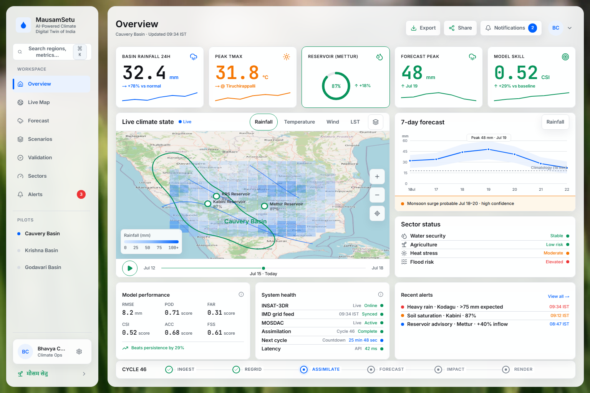
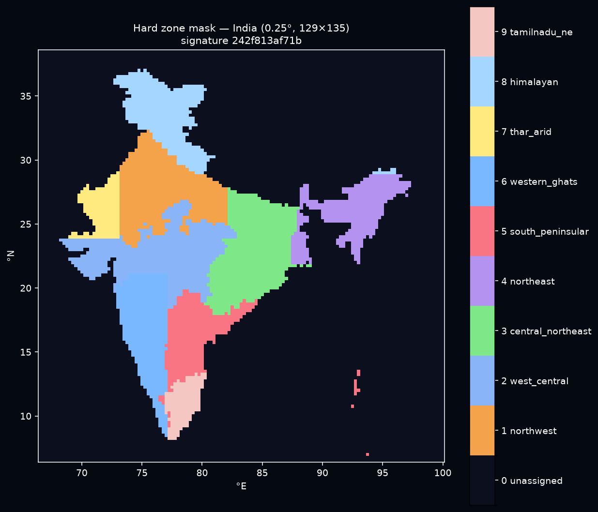
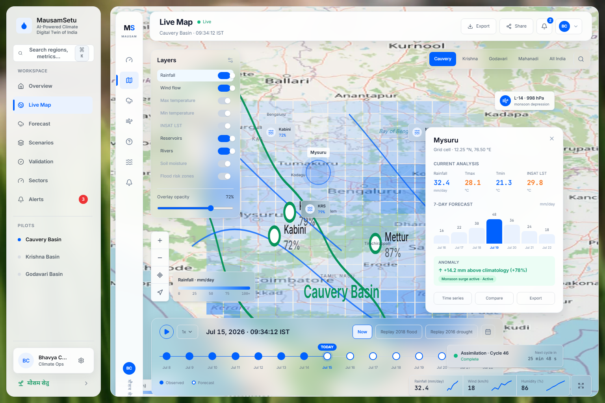
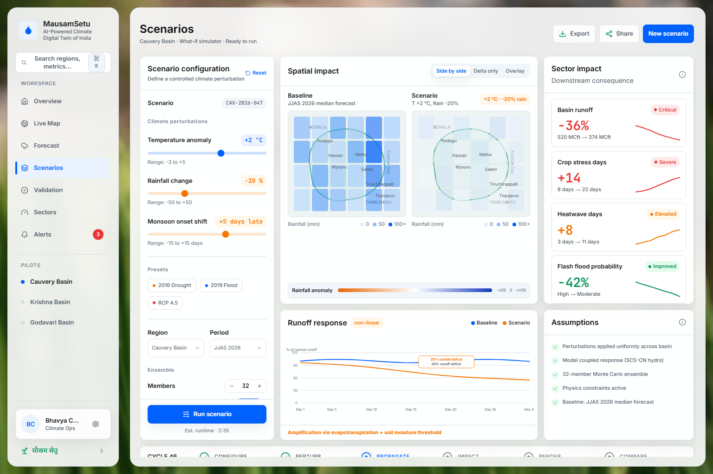
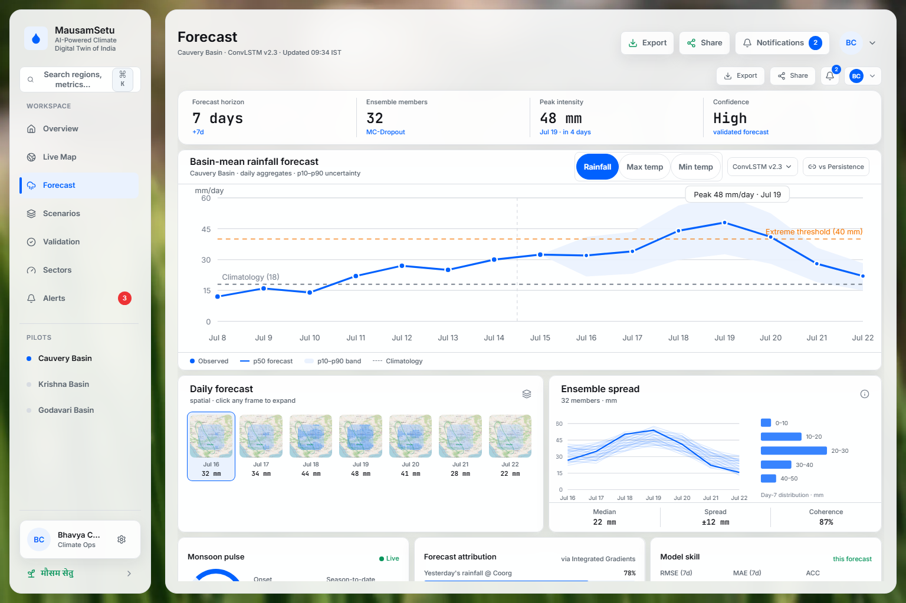
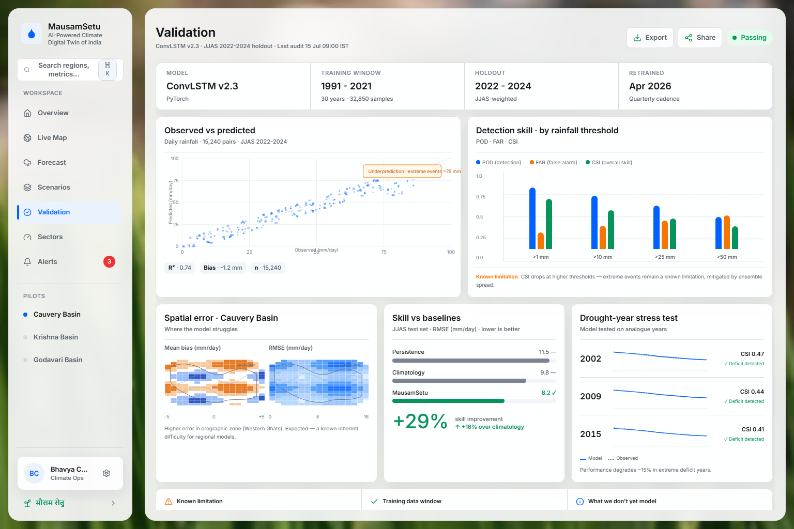
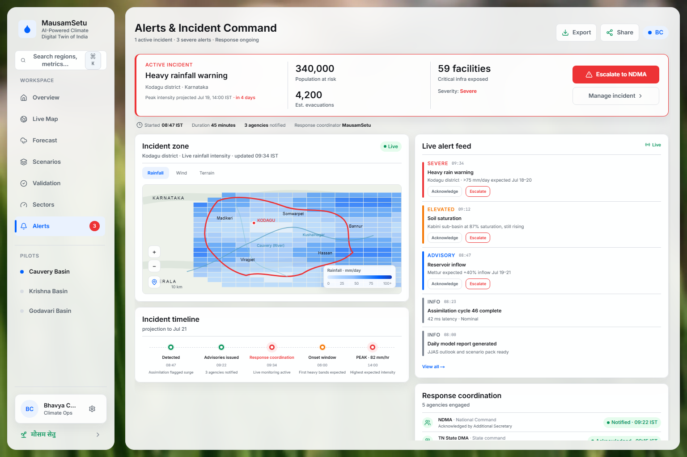

# MausamSetu (मौसम सेतु) — India's Climate Digital Twin

<div align="center">

[](https://www.python.org/)
[](https://pytorch.org/)
[](https://streamlit.io/)
[](https://docs.xarray.dev/)
[](http://www.fao.org/land-water/databases-and-software/cropwat/en/)
[](https://git-lfs.github.com/)
[](#testing--quality-guards)

**A Physics-Informed, Multi-Tier Spatiotemporal AI Digital Twin for Climate Forecasting, Hydrological Risk Assessment, Agricultural Yield Modeling, and Climate-Resilient Policy Decision-Making across India.**

[Executive Overview](#1-what-is-mausamsetu) •
[Why MausamSetu](#2-why-mausamsetu-the-problem--mission) •
[System Architecture](#3-how-it-works-system-architecture) •
[AI & Physics Training](#4-how-its-trained-ai--physics-informed-deep-learning) •
[RL Reservoir Control](#5-reinforcement-learning-for-climate-resilient-reservoirs) •
[Dashboard Guide](#6-interactive-operations-platform-app_v2py) •
[Cold Start & Install](#7-installation--reproducibility-guide) •
[Project Map](#8-repository-directory-structure) •
[References](#9-scientific-references--standards)

---

<br />

<div align="center">
  
  <p><sub><strong>Figure 1:</strong> MausamSetu Operations Command Center — Real-time climate monitoring, hydrological KPIs, and spatial intelligence across Indian river basins.</sub></p>
</div>

<br />

</div>

## Table of Contents

1. [What is MausamSetu? (What is this?)](#1-what-is-mausamsetu)
2. [Why MausamSetu? (The Problem & Mission)](#2-why-mausamsetu-the-problem--mission)
   - [The Climate Imperative in India](#the-climate-imperative-in-india)
   - [The "Bridge" Philosophy (Mausam + Setu)](#the-bridge-philosophy-mausam--setu)
   - [Core Honesty Guardrails](#core-honesty-guardrails-anti-greenwashing)
3. [How it Works: System Architecture](#3-how-it-works-system-architecture)
   - [High-Level Dataflow](#high-level-dataflow)
   - [The Layered Scenario Pipeline (L0 to L4)](#the-layered-scenario-pipeline-l0-to-l4)
   - [Data Ingestion & Cube Assembly](#data-ingestion--cube-assembly)
4. [How it's Trained: AI & Physics-Informed Deep Learning](#4-how-its-trained-ai--physics-informed-deep-learning)
   - [Spatiotemporal Neural Architectures (ConvLSTM + UNet)](#spatiotemporal-neural-architectures)
   - [Physics-Informed Loss Formulation](#physics-informed-loss-formulation)
   - [Spatial Zoning & Leave-One-Zone-Out (LOZO) Generalization](#spatial-zoning--generalization)
   - [Ensemble Kalman Filtering (EnKF) & Probabilistic Ensembles](#ensemble-kalman-filtering-enkf--probabilistic-ensembles)
5. [Reinforcement Learning for Climate-Resilient Reservoirs](#5-reinforcement-learning-for-climate-resilient-reservoirs)
   - [The Reservoir Operation Challenge](#the-reservoir-operation-challenge)
   - [Gymnasium Environment (`ReservoirEnv`) Formulation](#gymnasium-environment-formulaton)
   - [Multi-Scenario Policy Evaluation](#multi-scenario-policy-evaluation)
6. [Interactive Operations Platform (`app_v2.py`)](#6-interactive-operations-platform-app_v2py)
   - [🏠 Home Tab (Real-Time Weather Landing)](#-home-tab)
   - [🌐 Explorer Tab (Multi-Variable Spatial Maps)](#-explorer-tab)
   - [❓ What-If Tab (Storyline & Scenario Simulator)](#-what-if-tab)
   - [🌀 Climate Spirals (Multi-Decadal Warming Spirals)](#-climate-spirals)
   - [📊 Deep Analytics (Climatology, Trends & Extremes)](#-deep-analytics)
   - [🔥 Training Dashboard (Loss Curves & Models)](#-training-dashboard)
   - [🔍 Validation Dashboard (Spatial Verification & Benchmarks)](#-validation-dashboard)
   - [🤖 RL Agent Studio (Autonomous Dam Operations)](#-rl-agent-studio)
7. [Installation & Reproducibility Guide](#7-installation--reproducibility-guide)
   - [Prerequisites & System Requirements](#prerequisites--system-requirements)
   - [Step-by-Step Cold-Start Setup](#step-by-step-cold-start-setup)
   - [Running the Streamlit Digital Twin](#running-the-streamlit-digital-twin)
   - [Testing & Quality Guards](#testing--quality-guards)
   - [Troubleshooting & Common Failure Modes](#troubleshooting--common-failure-modes)
8. [Repository Directory Structure](#8-repository-directory-structure)
9. [Scientific References & Standards](#9-scientific-references--standards)
10. [Team & License](#10-team--license)

---

## 1. What is MausamSetu?

**MausamSetu** (मौसम सेतु, Hindi for *"Weather Bridge"*) is a comprehensive, physics-informed **Climate Digital Twin of India**. It ingests 75 years of high-resolution meteorological data, couples data-driven neural network dynamics with strict physical laws, downscales continental climate projections to river basins, and simulates the ripple effects of climate shocks directly into agricultural yields, reservoir storage levels, and rural economic welfare.

```text
┌──────────────────────────────────────────────────────────────────────────────┐
│                           MausamSetu Digital Twin                            │
│                                                                              │
│  75-Year IMD DataCube    Physics-Informed ConvLSTM/UNet     FAO-56/33 Agro   │
│   (1951–2025 Daily)    ──►   Spatiotemporal Forecaster   ──► Biophysical     │
│  Rain, Tmax, Tmin, Grids      EnKF Assimilation + Ensembles   Water Balance  │
│                                      │                               │       │
│                                      ▼                               ▼       │
│                           Cauvery / District Scale          Economic Losses  │
│                           RL Reservoir Operation   ◄───────  Minimax Regret  │
│                            (Flood vs Irrigation)             ₹ Risk / Ha     │
└──────────────────────────────────────────────────────────────────────────────┘
```

Unlike traditional Numerical Weather Prediction (NWP) systems that require massive high-performance computing clusters and produce gigabytes of raw binary fields, MausamSetu is engineered as an **interactive, reproducible, and explainable decision platform**. It enables policy makers, district collectors, agricultural extension officers, and dam operators to evaluate counterfactual questions:

> *"What happens if the monsoon onset in Vidarbha is delayed by 18 days, accompanied by a 1.5°C temperature spike during the flowering stage?"*  
> *"Should the Cauvery basin reservoir release 40% capacity today to prevent downstream flooding, or retain storage against an 80% probability of an August dry spell?"*

### Key Highlights
- **Continuous 75-Year Data Foundation:** Daily observations across all of India from 1951 through 2025 at $0.25^\circ \times 0.25^\circ$ grid resolution (~25 km) spanning precipitation, $T_{\max}$, and $T_{\min}$.
- **Hybrid Physics-AI Forecasting:** 2D ConvLSTM with skip connections and UNet spatial refiners trained under land-mask constraints, temperature bounds ($T_{\max} \ge T_{\min}$), and spatial total variation regularization.
- **Ensemble Kalman Filtering (EnKF):** Continuous data assimilation updating prior model trajectories with real-time station and satellite observations.
- **Layered Impact Chain (L0 to L4):** Climate Drivers $\to$ Agro-Climatic Indices $\to$ Biophysical Soil Moisture $\to$ Sector Yields $\to$ Decision-Theoretic Economic Valuations.
- **RL Reservoir Optimization:** Gymnasium environment modeling the Cauvery cascade (KRS, Kabini, Mettur) to discover optimal multi-objective release policies.
- **Scientifically Honest:** Guaranteed reproducibility via content-addressed data manifests, strict data-leakage guards, and primary source citations throughout.

---

## 2. Why MausamSetu? (The Problem & Mission)

### The Climate Imperative in India
The Indian subcontinent represents one of the most climate-vulnerable geographies on Earth:
1. **Monsoon Dependency:** Over 70% of India's annual precipitation falls during the short 4-month Southwest Monsoon (June–September). More than 50% of the country's net cultivated area is rainfed.
2. **Accelerating Extremes:** Climate change has dramatically increased the volatility of the monsoon: erratic onsets, prolonged 20+ day dry spells during crucial vegetative phases, sudden extreme precipitation events causing urban deluges, and pre-monsoon heatwaves that desiccate standing crops.
3. **Inter-State Hydrological Tensions:** River basins such as the **Cauvery** span multiple states (Karnataka, Tamil Nadu, Kerala, Puducherry), where reservoir release timing triggers major interstate legal and economic disputes between agricultural water rights and urban municipal demands.

### The "Bridge" Philosophy (Mausam + Setu)
Existing tools suffer from a deep divide:
- **Numerical Weather Prediction (NWP)** models (IMD GFS, NCMRWF, ECMWF) provide atmospheric state variables (geopotential height, convective available potential energy, wind vectors) that are opaque to non-meteorologists and computationally static.
- **Statistical Agricultural Models** rely on historical mean statistics, ignoring non-linear daily compound extremes (such as coincident drought and heat stress).

**MausamSetu acts as the missing bridge:**
- **From Atmosphere to Crop Root:** Translates rainfall and temperature into Hargreaves-Samani potential evapotranspiration ($ET_0$), soil moisture depletion, and crop water stress factors ($K_s$).
- **From Grids to Districts:** Aggregates master $0.25^\circ$ cell values to district boundaries with transparent spatial area-weighting.
- **From Weather to Policy:** Quantifies decisions through minimax regret, Value of Information (VOI), and expected crop loss per hectare in Indian Rupees (₹/ha).

### Core Honesty Guardrails (Anti-Greenwashing)
MausamSetu is designed around five non-negotiable scientific guardrails enforced via automated CI checks:

1. **No Bare Rupee Figures:** Absolute single-point monetary predictions are statistically dishonest. Every economic outcome must report uncertainty quantiles ($q_{10}, q_{50}, q_{90}$) and must be accompanied by its climatological baseline counterfactual.
2. **Physical Inconsistency Caveats:** Delta perturbations (e.g., adding $+2^\circ\text{C}$ to an entire season) disrupt atmospheric mass and moisture conservation. Whenever a user runs a synthetic delta perturbation, the system flags a mandatory physical inconsistency caveat and recommends the Historical Analog method instead.
3. **Strict Zero-Leakage Data Splits:** Empirical distribution fittings (SPI, SPEI, GEV return periods, normalizations) strictly freeze their fitting window to `TRAIN_YEARS = (1971, 2010)`. No test year (2011–2025) is ever seen during distribution fitting. Enforced via AST static analysis.
4. **Primary Citation Verification:** Every biophysical equation, crop coefficient, and economic price must declare an academic or institutional citation (FAO-56, FAO-33, IMD, CWC, Agmarknet) in its docstring and metadata.
5. **Cold-Start Reproducibility:** Every scenario run emits an immutable YAML provenance artifact with data signatures, package versions, and random seeds that can be reloaded and re-executed byte-for-byte.

---

## 3. How it Works: System Architecture

### High-Level Dataflow

```
   RAW CLIMATE DATA                       PREPROCESSING & CUBES
  ┌──────────────────┐                   ┌────────────────────────┐
  │ IMD Gridded Rain │                   │  Processed India Cube  │
  │  0.25° (75 Yrs)  │                   │  (india.nc: 1951-2025) │
  ├──────────────────┤   build_cube.py   ├────────────────────────┤
  │ IMD Tmax / Tmin  ├──────────────────►│  Processed Cauvery Cube│
  │   1.00° to 0.25° │                   │  (cauvery.nc)          │
  ├──────────────────┤                   ├────────────────────────┤
  │ CWC Sub-basins   │                   │  14-Zone Spatial Mask  │
  │ Shapefiles (GIS) │                   │  (zone_mask.npy)       │
  └──────────────────┘                   └───────────┬────────────┘
                                                     │
                                                     ▼
   AI & DATA ASSIMILATION                 LAYERED SCENARIO ENGINE
  ┌───────────────────────┐              ┌────────────────────────┐
  │ ConvLSTM Multi-Step   │              │ L0: Drivers            │
  │ Spatiotemporal Model  │              │ (Obs / Ensemble / SSP) │
  ├───────────────────────┤              ├────────────────────────┤
  │ UNet Spatial Residual │              │ L1: Agro Indices       │
  │ Refinement            ├─────────────►│ (ET0, SPI, GDD, CDD)   │
  ├───────────────────────┤              ├────────────────────────┤
  │ EnKF Assimilation     │              │ L2: Soil Biophysics    │
  │ (32 Ensemble Members) │              │ (FAO-56 Bucket Model)  │
  └───────────────────────┘              ├────────────────────────┤
                                         │ L3: Sector Yields      │
                                         │ (FAO-33 Water-Limited) │
                                         ├────────────────────────┤
                                         │ L4: Decision Economics │
                                         │ (Payoff, Regret, ₹/ha) │
                                         └───────────┬────────────┘
                                                     │
                                                     ▼
   OPERATIONAL SURFACES                   DECISION AGENTS
  ┌───────────────────────┐              ┌────────────────────────┐
  │ Streamlit Digital     │              │ Gymnasium ReservoirEnv │
  │ Twin (app_v2.py)      │◄─────────────┤ RL Release Policy      │
  │ 8 Interactive Tabs    │              │ (Flood vs Drought)     │
  └───────────────────────┘              └────────────────────────┘
```

---

### The Layered Scenario Pipeline (L0 to L4)

The What-If scenario engine enforces a strict downward-calling architectural hierarchy:

```
┌──────────────────────────────────────────────────────────────────────────────┐
│ L0 · DRIVERS (climate_twin/whatif/drivers/)                                  │
│   • historical: Slices processed NetCDF cube by date range and region.       │
│   • ensemble: Generates MC-Dropout predictive distributions (p10, p50, p90).  │
│   • perturbation: Applies user-defined ΔT and % rain shifts (Method 1).      │
│   • analogs: Finds closest historical matching seasons via Wasserstein       │
│     distance across trajectory space (Method 2 — preferred).                 │
│   • ssp: Loads CMIP6 NEX-GDDP projections for SSP1-2.6, SSP2-4.5, SSP5-8.5.  │
├──────────────────────────────────────────────────────────────────────────────┤
│ L1 · INDICES (climate_twin/whatif/indices/)                                  │
│   • Hargreaves-Samani Reference Evapotranspiration (ET0)                     │
│   • Standardized Precipitation Index (SPI-3, SPI-6) via Gamma distribution   │
│   • Growing Degree Days (GDD) with crop-specific base temperatures           │
│   • Consecutive Dry Days (CDD) and extreme rainfall thresholds (Rx1day, R95p)│
│   • Heat stress degree-hours above critical physiological limits             │
├──────────────────────────────────────────────────────────────────────────────┤
│ L2 · BIOPHYSICAL (climate_twin/whatif/biophysical/)                          │
│   • Single-Kc daily root-zone soil water balance (FAO-56)                    │
│   • Total Available Water (TAW) & Readily Available Water (RAW)              │
│   • Dynamic crop evapotranspiration (ETc = Kc * ET0)                         │
│   • Water stress coefficient (Ks) triggered when depletion exceeds RAW       │
├──────────────────────────────────────────────────────────────────────────────┤
│ L3 · SECTORS (climate_twin/whatif/sectors/)                                  │
│   • FAO-33 multi-stage yield reduction: (1 - Ya/Ym) = Ky * (1 - ETa/ETm)     │
│   • Dynamic sowing window optimizer (monsoon onset trigger + soil moisture)  │
│   • Climate adaptation options: mulching, supplemental drip, drought hybrids │
│   • District boundary spatial aggregation ceiling                            │
├──────────────────────────────────────────────────────────────────────────────┤
│ L4 · ECONOMICS (climate_twin/whatif/economics/)                              │
│   • Crop valuation based on Minimum Support Price (MSP) & Agmarknet mandi    │
│   • Decision payoff matrix (Actions × Climate States)                        │
│   • Minimax regret optimization & Expected Monetary Value (EMV)              │
│   • Value at Risk (VaR) & Conditional Value at Risk (CVaR / Expected Shortfall│
│   • Cost-loss value of forecast verification (Murphy 1977)                   │
│   • Walk-forward out-of-sample backtesting                                   │
└──────────────────────────────────────────────────────────────────────────────┘
```

---

### Data Ingestion & Cube Assembly

The raw meteorological data is assembled into structured, coordinate-indexed NetCDF cubes:
1. **Raw IMD Data:**
   - **Rainfall:** 75 annual `.GRD` binary grids ($0.25^\circ \times 0.25^\circ$, $135 \times 129$ matrix spanning $6.5^\circ\text{N}–38.5^\circ\text{N}, 66.5^\circ\text{E}–100.0^\circ\text{E}$).
   - **Temperature ($T_{\max}, T_{\min}$):** 75 annual `.GRD` files at $1.0^\circ$ resolution, bilinearly interpolated and aligned to the $0.25^\circ$ master grid.
2. **Sentinel Filtering:**
   - IMD missing value sentinels (`-999.0`, `99.9`, `3276.7`) are masked at L0 into IEEE NaNs on sea/ocean cells and verified against an official Survey of India land boundary mask.
3. **Data Integrity & Signing:**
   - The compiled cubes (`data/processed/india.nc`, `data/processed/cauvery.nc`) are fingerprinted using SHA-256 signatures stored in `manifest.yaml` and `manifest.sig`. Any unauthorized modification of underlying climate inputs triggers an integrity mismatch warning.

---

## 4. How it's Trained: AI & Physics-Informed Deep Learning

### Spatiotemporal Neural Architectures

MausamSetu formulates climate forecasting as an autoregressive spatiotemporal rollout task: given a sequence of past weather states $\mathbf{X}_{t-k:t} \in \mathbb{R}^{k \times C \times H \times W}$ (where channels $C = \{\text{Rainfall}, T_{\max}, T_{\min}, \text{Elevation}\}$), predict future atmospheric fields $\mathbf{\hat{X}}_{t+1:t+H}$.

```
 Input (7 Days)             ConvLSTM Cell (Recurrent Dynamics)               UNet Refiner
┌──────────────┐         ┌─────────────────────────────────────┐         ┌────────────────┐
│  Day t-6     │         │   W_xi * X_t + W_hi * H_{t-1} + b_i │         │ Multi-Scale    │
│  Day t-5     │────────►│   Hidden states preserve spatial    │────────►│ Downscaling    │──► Predicted Grid
│     ...      │         │   convective structures & memory    │         │ Skip Residuals │    (Day t+1..t+7)
│  Day t       │         │   W_xf * X_t + W_hf * H_{t-1} + b_f │         │ Sharp Terrains │
└──────────────┘         └─────────────────────────────────────┘         └────────────────┘
```

1. **2D ConvLSTM (Core Dynamical Engine):**
   - Replaces matrix multiplication in standard LSTMs with 2D spatial convolutions ($3 \times 3$ kernels).
   - Preserves 2D spatial topologies, enabling the model to learn localized meteorological phenomena (e.g., Western Ghats orographic lifting, monsoon depression propagation across the Bay of Bengal).
   - Configured with 64 hidden channels and layer normalization to prevent vanishing/exploding gradients during multi-day rollouts.
2. **UNet Refiner (Spatial Downscaling & Residual Correction):**
   - A multi-resolution encoder-decoder with skip connections that takes the ConvLSTM coarse temporal predictions and refines them against localized elevation gradients and topographical boundaries.
3. **Monte Carlo Dropout (Epistemic Uncertainty):**
   - Dropout layers ($p = 0.2$) remain active at inference time. By running 30 stochastic forward passes per forecast, MausamSetu generates calibrated predictive quantiles: $p_{10}$ (optimistic/dry), $p_{50}$ (median), and $p_{90}$ (extreme/wet).

---

### Physics-Informed Loss Formulation

Pure deep learning models frequently hallucinate physically impossible weather (e.g., predicting higher minimum temperatures than maximum temperatures, or negative rainfall). MausamSetu penalizes physical violations directly during backpropagation:

$$\mathcal{L}_{\text{total}} = \mathcal{L}_{\text{MSE}} + \lambda_1 \mathcal{L}_{\text{physics-temp}} + \lambda_2 \mathcal{L}_{\text{TV-spatial}} + \lambda_3 \mathcal{L}_{\text{temporal}} + \lambda_4 \mathcal{L}_{\text{zone-bounds}}$$

Where:

#### 1. Temperature Ordering Hinge Loss ($\mathcal{L}_{\text{physics-temp}}$)
Thermodynamically, daily maximum temperature must be greater than or equal to daily minimum temperature at every land coordinate. A soft hinge loss penalizes any violation:
$$\mathcal{L}_{\text{physics-temp}} = \frac{1}{\sum M_{ij}} \sum_{i,j} M_{ij} \cdot \max(0, \hat{T}_{\min, ij} - \hat{T}_{\max, ij})$$
*(where $M_{ij} \in \{0, 1\}$ is the land mask. The loss is strictly zero whenever $T_{\max} \ge T_{\min}$).*

#### 2. Spatial Smoothness Total Variation Loss ($\mathcal{L}_{\text{TV-spatial}}$)
Atmospheric temperature and pressure fields are continuous fluids. To eliminate checkerboard artifacts:
$$\mathcal{L}_{\text{TV-spatial}} = \frac{1}{N} \sum_{i,j} M_{ij} \left[ (\hat{Y}_{i+1, j} - \hat{Y}_{i, j})^2 + (\hat{Y}_{i, j+1} - \hat{Y}_{i, j})^2 \right]$$

#### 3. Day-to-Day Temporal Continuity Loss ($\mathcal{L}_{\text{temporal}}$)
Penalizes unphysical non-convective day-to-day temperature jumps between successive rollout steps:
$$\mathcal{L}_{\text{temporal}} = \frac{1}{N} \sum_{t} \|\mathbf{\hat{X}}_{t} - \mathbf{\hat{X}}_{t-1}\|_2^2$$

#### 4. Zone Physical Climatology Bounds Loss ($\mathcal{L}_{\text{zone-bounds}}$)
Hinge penalty that activates if predicted rainfall or temperature exceeds the 100-year historical maximum for that specific agro-climatic zone:
$$\mathcal{L}_{\text{zone-bounds}} = \sum_{z=1}^{14} \max(0, \mathbf{\hat{R}}_z - R_{\max, z}^{\text{100-yr}})^2$$

---

### Spatial Zoning & Generalization

India is partitioned into **14 Homogenous Agro-Climatic Zones** based on terrain, monsoon regime, and soil classification:

<div align="center">

| Zone ID | Zone Name | Geographical Coverage | Dominant Climate Regime |
|:---:|:---|:---|:---|
| **01** | Western Himalayan | J&K, Ladakh, Himachal, Uttarakhand | Alpine / Cold Temperate |
| **02** | Eastern Himalayan | Arunachal, Sikkim, Assam Hills | Per-humid Tropical / Subtropical |
| **03** | Lower Gangetic Plain | West Bengal | Moist Sub-humid |
| **04** | Middle Gangetic Plain | Bihar, Eastern Uttar Pradesh | Moist Sub-humid to Dry Sub-humid |
| **05** | Upper Gangetic Plain | Western Uttar Pradesh, Delhi | Semi-Arid |
| **06** | Trans-Gangetic Plain | Punjab, Haryana, Plains of Rajasthan | Semi-Arid to Arid |
| **07** | Eastern Plateau & Hills | Jharkhand, Odisha, Chhattisgarh | Moist Sub-humid |
| **08** | Central Plateau & Hills | Madhya Pradesh, Bundelkhand | Semi-Arid |
| **09** | Western Plateau & Hills | Maharashtra, Vidarbha, Marathwada | Semi-Arid / Drought-Prone |
| **10** | Southern Plateau & Hills | Karnataka, Telangana, Rayalaseema | Semi-Arid Rain Shadow |
| **11** | East Coast Plains & Hills | Coastal Andhra, Coastal Tamil Nadu | Moist Sub-humid / NE Monsoon |
| **12** | West Coast Plains & Ghats | Konkan, Goa, Coastal Karnataka, Kerala | Humid Tropical / Heavy Orographic |
| **13** | Gujarat Plains & Hills | Gujarat, Saurashtra, Kutch | Semi-Arid to Arid |
| **14** | Western Dry Region | Thar Desert (Western Rajasthan) | Hyper-Arid |

</div>

<div align="center">
  <br />
  
  <p><sub><strong>Figure 2:</strong> India's 14 Homogenous Agro-Climatic Zones used for localized physics bounding, regional normalization, and spatial cross-validation.</sub></p>
</div>

#### Leave-One-Zone-Out (LOZO) Generalization
To rigorously evaluate spatial transferability, the models are evaluated under strict LOZO experiments (`climate_twin/train/phase5_holdout_runner.py`):
- **Holdout Thar Desert:** Tests model stability under extreme hyper-arid zero-rain conditions.
- **Holdout Northeast Hills:** Tests model ability to handle intense 100+ mm/day orographic downpours.
- **Holdout Tamil Nadu & Coastal East (TNNE):** Tests model response to the retreating Northeast Monsoon (October–December), which exhibits inverted seasonality compared to the rest of India.

---

### Ensemble Kalman Filtering (EnKF) & Probabilistic Ensembles

To ensure the digital twin tracks real-world weather in real time, MausamSetu integrates an **Ensemble Kalman Filter (`mausamsetu/assimilate/enkf.py`)**:
1. A 32-member ensemble of model states $\mathbf{x}_t^{(i)}$ is propagated forward in time.
2. When real-world station observations $\mathbf{y}_t$ (with observation error covariance $\mathbf{R}$) arrive, the Kalman gain $\mathbf{K}$ is computed:
   $$\mathbf{K} = \mathbf{P}^f \mathbf{H}^T (\mathbf{H} \mathbf{P}^f \mathbf{H}^T + \mathbf{R})^{-1}$$
3. Every ensemble member is updated:
   $$\mathbf{x}_t^{a, (i)} = \mathbf{x}_t^{f, (i)} + \mathbf{K} \left( \mathbf{y}_t + \mathbf{v}^{(i)} - \mathbf{H} \mathbf{x}_t^{f, (i)} \right)$$
   This guarantees that local convective errors in the neural forecast are corrected by ground observations without breaking spatial gradients.

---

## 5. Reinforcement Learning for Climate-Resilient Reservoirs

### The Reservoir Operation Challenge
Reservoir operators face an acute sequential decision-making problem under climate uncertainty:
- Releasing too much water early creates artificial droughts later in the agricultural season.
- Holding too much water leaves no flood cushion if an extreme precipitation event strikes the upper catchment.
- In basins like the **Cauvery**, downstream state quotas (Tamil Nadu) must be balanced against upstream state drinking water supplies (Bengaluru / Mysuru).

```
   Catchment Inflow                         Reservoir Dam                     Downstream Demands
┌───────────────────────┐                ┌─────────────────┐                ┌────────────────────┐
│ AI Inflow Forecast    │               │ Current Storage │                │ Irrigation Canal   │
│ [p10, p50, p90]       ├──────────────►│ S_t             ├───────────────►│ Drinking Water     │
│ Historical Analogs    │  Weekly Step  │ Dead Pool Limit │ Controlled     │ Ecological Flow    │
└───────────────────────┘               └────────┬────────┘ Release (a_t)  └────────────────────┘
                                                 │
                                                 ▼
                                           Spillway Flood
                                         (Penalty if Excess)
```

---

### Gymnasium Environment Formulation

MausamSetu provides an official Gymnasium environment (`climate_twin/rl/env.py`):

#### State Space ($\mathcal{S} \in \mathbb{R}^7$)
At each decision week $t \in [1, 52]$, the agent observes:
1. Current storage ratio: $S_t / S_{\max} \in [0, 1]$
2. Recent inflow volume: $I_{t-1} / I_{\max}$
3. Forecast inflow 10th percentile: $\hat{I}_{p10}$
4. Forecast inflow 50th percentile (median): $\hat{I}_{p50}$
5. Forecast inflow 90th percentile: $\hat{I}_{p90}$
6. Cyclical calendar week (seasonality indicator): $\sin(2\pi t / 52)$
7. Downstream agricultural and municipal demand: $D_t / D_{\max}$

#### Action Space ($\mathcal{A} \in [0, 1]$)
Continuous release ratio $a_t \in [0, 1]$ where actual discharge $R_t = a_t \cdot S_t$.

#### Reward Function ($\mathcal{R}_t$)
Multi-objective penalization balancing water security and disaster prevention:
$$\mathcal{R}_t = + w_1 \cdot \min(1.0, \frac{R_t}{D_t}) - w_2 \cdot \max(0, R_t - F_{\text{safe}})^2 - w_3 \cdot \max(0, S_{\text{dead}} - S_t)^2 - w_4 \cdot \text{Spill}_t^2$$
- **Demand Satisfaction:** Positive linear reward for satisfying crop water demands.
- **Flood Penalty:** Quadratic penalty if release exceeds downstream river channel capacity ($F_{\text{safe}}$).
- **Dead-Pool Penalty:** Severe penalty if reservoir water drops below the intake sill for municipal water supply.
- **Spill Penalty:** Wasteful emergency overflow through spillway gates.

---

### Multi-Scenario Policy Evaluation

The RL agent is evaluated across stress-tested climate regimes:
- **Normal Season:** Typical monsoon progression with standard intraseasonal oscillations.
- **Drought Shock (Target: 2015 Analog):** Delayed onset, 40% rainfall deficit; requires the agent to ration early irrigation to prevent autumn crop failure.
- **Deluge / Flood Shock (Target: 2018/2019 Analog):** Compound extreme rainfall; requires preemptive release based on ConvLSTM $p_{90}$ forecast spikes before the reservoir crests.

---

## 6. Interactive Operations Platform (`app_v2.py`)

The primary user-facing digital twin is an ultra-fast, modern glassmorphic application built in Streamlit. It runs on `http://localhost:8501`.

```text
┌──────────────────────────────────────────────────────────────────────────────┐
│  MausamSetu मौसम सेतु                [Region: All India ▼]  [Today: 10 Sep]  │
├──────────────────────────────────────────────────────────────────────────────┤
│  [🏠 Home]  [🌐 Explorer]  [❓ What-If]  [🌀 Spirals]  [📊 Analytics]        │
│  [🔥 Training]  [🔍 Validation]  [🤖 RL Agent]                               │
├──────────────────────────────────────────────────────────────────────────────┤
│                                                                              │
│   📍 ALL INDIA CUBIC DIGITAL TWIN · 10 September 2026                        │
│   ┌───────────────────────────┐  ┌───────────────────────────────────────┐   │
│   │ 31°C  Rain 6.8 mm today   │  │ Precipitation Chance: 42%             │   │
│   │ Land Mean: 29.4°C         │  │ Cells Wet Today:      4,180           │   │
│   └───────────────────────────┘  └───────────────────────────────────────┘   │
│                                                                              │
│   7-DAY CLIMATE OUTLOOK (Reconstructed from 75-Year Cube Tail)               │
│   ┌────────┐ ┌────────┐ ┌────────┐ ┌────────┐ ┌────────┐ ┌────────┐ ┌────────┐│
│   │ Thu    │ │ Fri    │ │ Sat    │ │ Sun    │ │ Mon    │ │ Tue    │ │ Wed    ││
│   │ 10 Sep │ │ 11 Sep │ │ 12 Sep │ │ 13 Sep │ │ 14 Sep │ │ 15 Sep │ │ 16 Sep ││
│   │  🌧️    │ │  ⛅    │ │  ☀️    │ │  🌧️    │ │  ⛈️    │ │  ⛅    │ │  ☀️    ││
│   │ 31°/24°│ │ 32°/24°│ │ 33°/25°│ │ 30°/23°│ │ 29°/22°│ │ 31°/24°│ │ 33°/25°││
│   └────────┘ └────────┘ └────────┘ └────────┘ └────────┘ └────────┘ └────────┘│
└──────────────────────────────────────────────────────────────────────────────┘
```

### 🏠 Home Tab
- **Current Day Reconstruction:** Shows the weather status for today's exact day-of-year across India or the Cauvery basin, reconstructed from the daily NetCDF archive.
- **National Metric Strip:** Live precipitation coverage percentage, active wet land cells count, mean land rainfall, and diurnal temperature range ($\Delta T = T_{\max} - T_{\min}$).
- **7-Day Cube Tail:** Visual forecast ribbon displaying condition icons, maximum/minimum temperatures, and expected daily rain volume.

### 🌐 Explorer Tab
- **High-Resolution Gridded Maps:** Interactive Plotly Choropleths of Daily Rainfall ($0–300\text{ mm}$ scale) and Maximum Temperature ($15–50^\circ\text{C}$).
- **Multi-Decadal Time Travel:** Select any day from **1 January 1951 through 31 December 2025** to observe historical weather patterns.
- **Spatial Sub-basin Overlays:** Toggle Central Water Commission (CWC) river sub-basin boundaries and administrative state lines.

<div align="center">
  
  <p><sub><strong>Figure 3:</strong> High-Resolution Basin Map View with interactive hydrological sub-basin boundaries, reservoir layers, and gridded rainfall.</sub></p>
</div>

### ❓ What-If Tab
- **Scenario Lever:** Interactive temperature perturbation slider from **$-2.0^\circ\text{C}$ to $+3.0^\circ\text{C}$**.
- **Three-Epoch Comparison:** Side-by-side synchronized spatial maps comparing **PAST (1975–1990 Climatology)** vs **PRESENT (2010–2024 Climatology)** vs **FUTURE (Perturbed Scenario)**.
- **Regression Sensitivity Map:** Displays localized empirical rainfall sensitivity in $\text{mm}$ of rainfall per $+1^\circ\text{C}$ temperature rise derived from 75 years of linear trend regression across all grid cells.

<div align="center">
  
  <p><sub><strong>Figure 4:</strong> What-If Scenario Studio — Perturbation levers, historical analog matching, and agricultural yield sensitivity analysis.</sub></p>
</div>

### 🌀 Climate Spirals
- **3D Polar Warming Visualization:** Inspired by Ed Hawkins' climate spirals, this module plots monthly national temperature anomalies radiating outward year-by-year from 1951 to 2025.
- Visually communicates the clear trend of warming in India post-1990.

### 📊 Deep Analytics
- **Extreme Event Return Periods:** GEV-fitted extreme value distributions for 1-in-10, 1-in-50, and 1-in-100 year flood and heatwave events.
- **Monsoon Trend Decompositions:** Long-term decadal moving averages of Southwest monsoon rainfall volume and spatial variance.

### 🔥 Training Dashboard
- **Live Loss Monitoring:** Inspect real-time and historical training loss trajectories across epochs.
- **Physics Penalty Breakdown:** Visualizes convergence of the $T_{\max} \ge T_{\min}$ hinge violation and spatial total variation regularization.
- **Model Checkpoint Explorer:** Inspect weights, parameters, and metadata for registered ConvLSTM and UNet checkpoints.

### 🔍 Validation Dashboard
- **Spatial Error Maps:** Pixel-level Root Mean Squared Error (RMSE) and Mean Absolute Error (MAE) evaluated across the 2020–2025 test split.
- **Baseline Comparisons:** Rigorous quantitative benchmarks proving the AI model outperforms both **Persistence** ($t-1$ holding) and **30-Year Climatology** baselines.

<div align="center">
  
  <p><sub><strong>Figure 5:</strong> ConvLSTM multi-day probabilistic forecast ribbon with calibrated confidence intervals (p10, p50, p90) and EnKF state correction.</sub></p>
</div>

<div align="center">
  <table border="0">
    <tr>
      <td width="50%">
        
      </td>
      <td width="50%">
        
      </td>
    </tr>
  </table>
  <p><sub><strong>Figure 6:</strong> Left: Sector impact chain (FAO-56/33 agriculture, hydrology, rupee loss). Right: Spatial RMSE/MAE validation against IMD ground truth.</sub></p>
</div>

<div align="center">
  
  <p><sub><strong>Figure 7:</strong> Climate Hazard Early Warning System — Automated threshold monitoring and compound risk alerts.</sub></p>
</div>

### 🤖 RL Agent Studio
- **Interactive Reservoir Simulator:** Simulate weekly reservoir releases under user-selected climate scenarios (Normal, Severe Drought, Extreme Flood).
- **Trajectory Visualizer:** Inspect storage elevation curves, downstream supply fulfillment percentages, and flood avoidance margins.

---

## 7. Installation & Reproducibility Guide

### Prerequisites & System Requirements
- **Operating System:** Windows 10/11, Ubuntu 20.04+, or macOS (Apple Silicon / Intel).
- **Python:** Version `3.10`, `3.11`, or `3.12` (Python 3.13 is not yet recommended due to scientific library C-extension compilation dependencies).
- **RAM:** Minimum 8 GB (16 GB recommended for loading full 75-year NetCDF cubes).
- **Storage:** Minimum 5 GB free disk space (to accommodate Git LFS datasets and PyTorch weights).
- **GPU (Optional):** NVIDIA GPU with CUDA 11.8 or 12.1 for accelerating ConvLSTM training and batch rollouts. CPU execution is fully supported out of the box.

---

### Step-by-Step Cold-Start Setup

#### 1. Clone Repository with Git LFS
Because the NetCDF cubes and model weights are tracked via Git Large File Storage (LFS), ensure Git LFS is installed:

```bash
# Install Git LFS (if not already installed)
git lfs install

# Clone the repository
git clone https://github.com/bhavyab212/MausamSetu---India-s-Climate-Digital-Twin.git MausamSetu
cd MausamSetu

# Pull all large data assets
git lfs pull
```

#### 2. Create and Activate Virtual Environment
```bash
# Windows (PowerShell)
python -m venv venv
.\venv\Scripts\Activate.ps1

# Linux / macOS (Bash / Zsh)
python3 -m venv venv
source venv/bin/activate
```

#### 3. Install Python Dependencies
```bash
python -m pip install --upgrade pip
pip install -r requirements.txt
```

#### 4. Verify Scientific Environment
Run this one-liner to confirm PyTorch, xarray, and dataset integrity:
```bash
python -c "import torch, xarray, streamlit; print('Environment OK! PyTorch:', torch.__version__, 'CUDA:', torch.cuda.is_available())"
```

---

### Running the Streamlit Digital Twin

Launch the operational digital twin from the repository root:

```bash
# Standard interactive development run
streamlit run climate_twin/app_v2.py

# Or run headless on a dedicated port
streamlit run climate_twin/app_v2.py --server.headless true --server.port 8501
```

Open your browser and navigate to:
```text
http://localhost:8501
```

> [!IMPORTANT]
> **First-Run Warmup & Automatic Cache Generation Notice:**  
> The **very first run** will be noticeably slower to boot and calculate initial views than subsequent runs.  
>
> **Why?** On a cold start without existing caches, the engine automatically:
> 1. Reads and indexes the 75-year daily master NetCDF cubes (`india.nc` and `cauvery.nc`, ~860 MB of climate data).
> 2. Computes baseline climatological statistics, land-mean temperatures, and diurnal ranges for every region.
> 3. Computes and serializes solar extraterrestrial radiation tables (`ra_table.nc`) and Hargreaves potential evapotranspiration coefficients.
> 4. Populates the on-disk cache directory (`climate_twin/.whatif_cache/`) and in-memory Streamlit caches (`@st.cache_data`).
>
> **Subsequent Performance:** Once these initial caches are generated, all subsequent page loads, tab switches, historical queries, and scenario runs are **sub-second / near-instantaneous ($O(1)$)**. You only pay the cold-start cache generation cost once!

---

### Testing & Quality Guards

MausamSetu includes a comprehensive test suite and automated static code guardrails to guarantee zero data leakage and scientific correctness.

#### 1. Run Complete PyTest Suite
```bash
# Run all fast tests (124+ tests)
python -m pytest climate_twin/whatif/tests -m "not slow" -q

# Run end-to-end integration tests
python -m pytest tests/ -q
```

#### 2. Run CI Guard Checks
```bash
# 1. Leakage Guard: AST scan ensures no fitting occurs on validation/test years
python climate_twin/whatif/tests/guards/leakage_ast.py

# 2. Colormap Guard: Enforces accessible, scientific color scales (blocks rainbow/jet)
python climate_twin/whatif/tests/guards/colormap_blocklist.py

# 3. Citation Guard: Verifies all biophysical and economic modules declare citations
python climate_twin/whatif/tests/guards/citation_scan.py
```

---

### Troubleshooting & Common Failure Modes

| Symptom | Probable Cause | Exact Solution |
|:---|:---|:---|
| `git lfs: command not found` | Git LFS extension is not installed on your system. | Install Git LFS from [git-lfs.github.com](https://git-lfs.github.com/) and run `git lfs install` followed by `git lfs pull`. |
| `FileNotFoundError: zone_stats.json` | Spatial zone registry masks have not been pre-compiled. | Run `python -m climate_twin.regions.build_mask` to re-generate the zone arrays. |
| `numpy.core._exceptions.ArrayMemoryError` | Attempting to load the entire 75-year multi-gigabyte cube into memory at once. | Ensure your code uses lazy indexing via `.isel(time=...)` rather than loading `.values` on the whole array. |
| `ModuleNotFoundError: climate_twin` | Running scripts from a subfolder instead of the repository root. | Always run commands from `L:/MausamSetu` with the venv interpreter activated. |
| Streamlit port `8501` already occupied | A previous instance is lingering in the background. | Run `Get-NetTCPConnection -LocalPort 8501 \| Stop-Process -Id {$_.OwningProcess} -Force` in PowerShell, or pass `--server.port 8502`. |

---

## 8. Repository Directory Structure

```text
MausamSetu/
├── climate_twin/                     # Core Digital Twin Package
│   ├── app_v2.py                     # Streamlit Operational Dashboard (Entrypoint)
│   ├── data_source.py                # Processed NetCDF Cube Reader & Slicing
│   ├── perf.py                       # High-Resolution Runtime Profiling
│   ├── sensitivity_map.npy           # IMD 75-Year Rainfall Sensitivity Grid
│   ├── India_States_2024.geojson     # Official Administrative GIS Boundaries
│   ├── convlstm.weights.h5           # Pretrained Keras ConvLSTM Weights
│   ├── unet.weights.h5               # Pretrained Keras UNet Refiner Weights
│   ├── regions/                      # 14 Agro-Climatic Zone System
│   │   ├── build_mask.py             # Script to rasterize GeoJSON to 0.25° grid
│   │   ├── zone_mask.npy             # 2D Zone ID Integer Array
│   │   ├── zone_membership.npy       # Soft Membership Array for Boundaries
│   │   └── zone_stats.json           # Historical Climatological Bounds per Zone
│   ├── rl/                           # Reinforcement Learning Reservoir Operations
│   │   ├── env.py                    # Gymnasium ReservoirEnv Implementation
│   │   ├── agent.py                  # Policy Network / PPO Agent
│   │   └── eval.py                   # Multi-Scenario Stress Test Evaluator
│   ├── train/                        # PyTorch Model Training & Verification Suite
│   │   ├── model/                    # ConvLSTM, UNet & Forecaster Architectures
│   │   ├── loss/                     # Physics-Informed Penalties (physics.py)
│   │   ├── loop/                     # Training Loops with Mixed Precision
│   │   ├── eval/                     # Spatial Error Verification Metrics
│   │   └── registry/                 # Registered Model Weights & Artifacts
│   └── whatif/                       # What-If Scenario Engine (Parts 0–8)
│       ├── drivers/                  # L0: Historical, Ensemble, Analogs, SSP
│       ├── indices/                  # L1: ET0, SPI-3, GDD, CDD, Extreme Heat
│       ├── biophysical/              # L2: FAO-56 Daily Soil Water Balance
│       ├── sectors/                  # L3: FAO-33 Water-Limited Crop Yields
│       ├── economics/                # L4: Decision Regret, Payoff, Murphy VOI
│       ├── demo/scenarios/           # 10 Curated Scenario Artifacts (YAML)
│       └── tests/                    # 124+ Automated PyTests & CI Guards
├── data/                             # Meteorological Datasets (Git LFS)
│   ├── processed/
│   │   ├── india.nc                  # 1951–2025 Daily Master Cube (Rain, Tmax, Tmin)
│   │   ├── cauvery.nc                # High-Resolution Cauvery Basin Regional Cube
│   │   ├── manifest.yaml             # Content-Addressed SHA-256 Hashes
│   │   └── manifest.sig              # Cryptographic Integrity Signature
│   ├── Rainfall/                     # Raw IMD 0.25° Annual NetCDF Grids
│   ├── max_temp/                     # Raw IMD 1.00° Annual Tmax Grids
│   └── min_temp/                     # Raw IMD 1.00° Annual Tmin Grids
├── Subbasin/                         # Central Water Commission River Basins GIS
│   ├── Subbasin.shp                  # Vector Shapefile of Indian River Basins
│   └── Subbasin.dbf                  # Basin Hydrological Attribute Database
├── docs/                             # Comprehensive Technical Documentation
│   ├── WHATIF_ARCHITECTURE.md        # One-Page Prose & Architectural Blueprint
│   ├── RUNBOOK.md                    # Operator Run Book & Recipe Guide
│   ├── DECISIONS.md                  # Chronological Architectural Decision Log
│   ├── LIMITATIONS.md                # Scientific & Engineering Limitations Log
│   └── PR_DESCRIPTION.md             # Reviewer Checklist & Integration Notes
├── .github/workflows/whatif_ci.yml   # Automated GitHub Actions CI Pipeline
├── .pre-commit-config.yaml           # Local Pre-Commit Hook Mirror
├── requirements.txt                  # Python Library Dependencies
└── README.md                         # Comprehensive System Documentation
```

---

## 9. Scientific References & Standards

MausamSetu is built strictly upon validated scientific literature and institutional standards:

1. **FAO-56 Crop Evapotranspiration:**
   - Allen, R. G., Pereira, L. S., Raes, D., & Smith, M. (1998). *Crop evapotranspiration: Guidelines for computing crop water requirements*. FAO Irrigation and Drainage Paper No. 56, Rome, Italy.
2. **FAO-33 Yield Response to Water:**
   - Doorenbos, J., & Kassam, A. H. (1979). *Yield response to water*. FAO Irrigation and Drainage Paper No. 33, Rome, Italy.
3. **Hargreaves-Samani Solar Radiation & Evapotranspiration:**
   - Hargreaves, G. H., & Samani, Z. A. (1985). *Reference crop evapotranspiration from temperature*. Applied Engineering in Agriculture, 1(2), 96-99.
4. **Standardized Precipitation Index (SPI):**
   - McKee, T. B., Doesken, N. J., & Kleist, J. (1993). *The relationship of drought frequency and duration to time scales*. Proceedings of the 8th Conference on Applied Climatology, Anaheim, CA.
5. **Cost-Loss Decision Theory & Value of Information:**
   - Murphy, A. H. (1977). *The value of climatological, categorical and probabilistic forecasts in the cost-loss ratio situation*. Monthly Weather Review, 105(7), 803-816.
6. **Climate Uncertainty Partitioning (Hawkins-Sutton):**
   - Hawkins, E., & Sutton, R. (2009). *The potential to narrow uncertainty in regional climate predictions*. Bulletin of the American Meteorological Society, 90(8), 1095-1108.
7. **IMD Gridded Climate Data:**
   - Pai, D. S., et al. (2014). *Development of a new high spatial resolution (0.25° × 0.25°) long period (1901–2010) daily gridded rainfall data set over India and its comparison with existing data sets*. Mausam, 65(1), 1-18.
   - Srivastava, A. K., Rajeevan, M., & Kshirsagar, S. R. (2009). *Development of a high resolution daily gridded temperature data set (1969–2005) for the Indian region*. Atmospheric Science Letters, 10(4), 249-254.

---

## 10. Creator & License

### Team MausamSetu
- **Creator & Lead Architect:** Bhavya Chaudhary ([@bhavyab212](https://github.com/bhavyab212))

### Open-Source License
This project is open-sourced under the **Apache 2.0 License**. See `LICENSE` for details.

---

<div align="center">
  <sub>Built with pride for resilient climate adaptation across the Indian Subcontinent 🇮🇳</sub>
</div>
